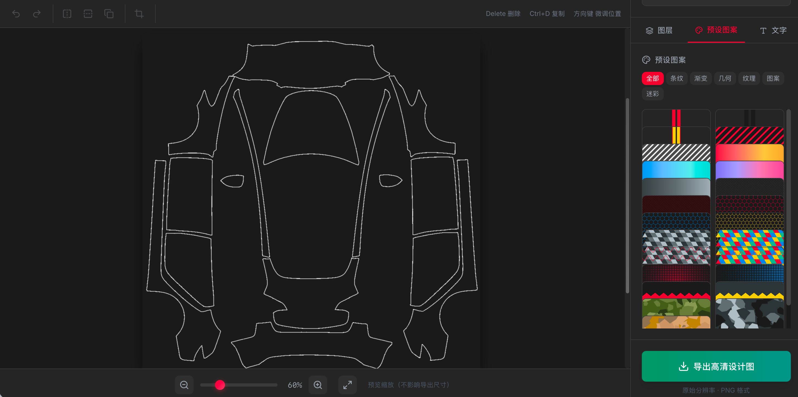

# Tesla Wrap Studio 🚗✨

专业车身改色与拉花设计工具 - Web 版


## ✨ 功能特性

### 核心功能
- 🎨 **智能遮罩处理** - 自动识别车身区域，外部自动遮盖
- 📦 **贴图层管理** - 支持导入、拖拽、旋转、缩放、层级调整
- ✍️ **文字填充** - 在车身区域内生成重复文字图案
- 🖼️ **高质量导出** - 保持原模板分辨率，PNG 透明背景
- 📱 **跨平台** - 浏览器即可使用，无需安装

### 高级编辑功能
- ↩️ **撤销/重做** - 支持最多50步历史记录 (Ctrl+Z / Ctrl+Shift+Z)
- ↔️ **翻转功能** - 水平翻转 / 垂直翻转
- 👁️ **透明度调节** - 0-100% 精确控制
- 📐 **非等比缩放** - 可切换等比/自由缩放模式，独立调整宽高
- ✂️ **裁切工具** - 选中图片后自由裁切
- 📋 **快速复制** - Ctrl+D 一键复制图层

### 🎨 颜色调整
- 🌈 **色相调节** - -180° ~ +180° 全色相范围
- 🎛️ **饱和度** - 精确控制颜色鲜艳度
- ☀️ **亮度调节** - 明暗控制
- 🎚️ **对比度** - 增强或减弱图像对比
- 🔄 **一键重置** - 快速恢复原始颜色

### 📐 智能对齐与吸附
- 🧲 **智能吸附** - 移动时自动吸附到画布边缘和中心线
- ⬅️ **快速对齐** - 水平居中、垂直居中、靠左、靠右、靠上、靠下

### 🔷 形状工具
- ⬜ **基础形状** - 矩形、圆形、三角形
- ⬡ **高级形状** - 多边形（可调边数）、星形
- ➡️ **方向形状** - 箭头、线条
- 🎨 **自定义样式** - 填充色、边框色、边框粗细
- 🔧 **交互调整** - 添加后可自由移动、缩放、旋转

### ✏️ 画笔工具
- 🖌️ **自由绘制** - 在画布上自由涂鸦
- 🎨 **颜色选择** - 自定义画笔颜色 + 快捷色板
- 📏 **粗细调节** - 1-50px 画笔粗细
- 👀 **实时预览** - 画笔粗细可视化预览

### 🔲 透视变形
- 📐 **四角控制** - 通过拖拽四个角点实现透视效果
- 🎯 **精确变形** - 适配车身曲面的透视调整
- ⏱️ **实时预览** - 变形效果即时可见

### 📋 设计模板系统
- 🚗 **按车型分类** - 模板按车型自动分类，切换车型后自动加载对应模板
- 🖼️ **图片模板** - 直接展示模板图片，点击即可添加到画布
- 📂 **模板目录** - `public/templates/{车型目录}/` 存放对应车型的预设模板图片

### 预设图案库
- 🏁 **25+ 款预设图案** - 程序化生成，无版权问题
- 📁 **7 大分类** - 条纹、渐变、几何、纹理、图案、迷彩等
- 🎨 **一键应用** - 点击即可添加到画布

## ⌨️ 快捷键

| 快捷键 | 功能 |
|--------|------|
| `Ctrl + Z` | 撤销 |
| `Ctrl + Shift + Z` | 重做 |
| `Ctrl + D` | 复制选中图层 |
| `Delete` / `Backspace` | 删除选中图层 |
| `↑ ↓ ← →` | 微调位置 (1px) |
| `Shift + 方向键` | 快速移动 (10px) |

## 📖 使用指南

1. **选择车型** - 从下拉菜单中选择 Tesla 车型（支持9款车型）
2. **添加图案** - 从预设图案库选择，或点击「导入图案/改色膜」上传自定义图片
3. **调整图案** - 拖拽移动，使用工具栏翻转/裁切，滑块调整透明度、旋转和缩放
4. **颜色调整** - 选中图片后，使用「调色」面板调整色相、饱和度、亮度和对比度
5. **绘制形状** - 使用「形状」面板添加矩形、圆形、三角形等各种形状
6. **自由绘制** - 使用「画笔」面板在画布上自由涂鸦
7. **智能对齐** - 使用「对齐」面板快速对齐元素，或启用吸附功能自动对齐
8. **透视变形** - 在「对齐」面板点击「进入透视模式」，拖拽四个角点实现透视效果
9. **文字填充** - 切换到「文字」面板，输入文字后点击「生成文字填充」
10. **使用模板** - 使用「模板」面板点击预设模板图片添加到画布
11. **导出设计** - 点击「导出高清设计图」保存作品

## 📋 模板系统使用

### 添加预设模板

1. 在 `public/templates/` 目录下创建对应车型的文件夹
2. 将模板图片（png/jpg/webp）放入该文件夹
3. 重新启动开发服务器（或重新构建）
4. 切换到该车型后，模板将自动出现在「模板」面板中
5. 点击模板图片即可替换当前画布底图

> 💡 图片文件名会自动作为模板名称显示（不含扩展名）

### 车型与目录对应关系

| 车型名称 | 目录名称 |
|---------|---------|
| Cybertruck | `Cybertruck` |
| 焕新款 Model 3 | `Model3-New` |
| 焕新款 Model 3 高性能版 | `Model3-New-Performance` |
| Model 3 | `Model3` |
| 焕新款 Model Y | `ModelY-New` |
| 焕新款 Model Y 高性能版 | `ModelY-New-Performance` |
| 焕新款 Model Y 长续航版 | `ModelY-New-LongRange` |
| Model Y L | `ModelY-L` |
| Model Y | `ModelY` |

### 目录结构示例

```
public/templates/
├── Cybertruck/
│   ├── 赛车条纹.png
│   └── 隐形黑.png
├── Model3/
│   ├── 渐变蓝.png
│   └── 碳纤维.jpg
└── ModelY/
    └── 几何图案.webp
```

## 🎨 预设图案

所有预设图案均为程序化生成，无版权问题：

| 分类 | 图案 |
|------|------|
| 条纹 | 赛车条纹（红/黑/金）、斜条纹（红黑/白灰）、闪电条纹 |
| 渐变 | 日落、海洋、紫霞、暗夜 |
| 几何 | 蜂窝网格（红/蓝/金线）、几何三角（暗色/彩色） |
| 纹理 | 碳纤维纹理（黑/红） |
| 图案 | 波浪纹、点阵渐变（中心/水平） |
| 迷彩 | 军绿、都市灰、沙漠 |

## 🛠️ 技术栈

- **React 18** - 现代 UI 框架
- **Fabric.js** - 强大的 Canvas 操作库
- **Tailwind CSS** - 原子化 CSS 框架
- **Vite** - 极速构建工具
- **Lucide React** - 精美图标库

## 📁 项目结构

```
root/
├── public/
│   ├── assets/              # 车型模板图片 (9款Tesla车型)
│   └── templates/           # 设计模板目录 (用户可添加 .json 模板文件)
├── src/
│   ├── utils/
│   │   ├── maskProcessor.js    # 遮罩处理算法
│   │   ├── textGenerator.js    # 文字填充生成器
│   │   ├── patternGenerator.js # 预设图案生成器
│   │   ├── colorAdjustment.js  # 颜色调整工具 (HSL调整)
│   │   └── templateManager.js  # 模板管理器
│   ├── App.jsx              # 主应用组件
│   ├── main.jsx             # 入口文件
│   └── index.css            # 全局样式
├── index.html
├── package.json
├── vite.config.js
└── tailwind.config.js
```

## 🚀 快速开始

```bash
# 安装依赖
npm install

# 启动开发服务器
npm run dev

# 构建生产版本
npm run build
```

## 🔧 核心算法

### 遮罩处理 (Flood Fill)

使用扫描线优化的泛洪填充算法，从图像四角开始填充，自动识别车身内外区域：

```javascript
// 三层结构
1. 线条区域 → 浅白色（车身轮廓）
2. 外部区域 → 背景色（遮盖外部）
3. 内部区域 → 透明（显示贴图）
```

### 文字填充

支持交错排列、旋转、自定义间距，仅在车身内部区域渲染文字。

### 预设图案生成

使用 Canvas API 程序化生成各类图案：
- 条纹：线性填充 + 旋转变换
- 渐变：线性/径向渐变
- 几何：数学计算生成六边形/三角形网格
- 纹理：交替填充模拟编织效果
- 迷彩：随机不规则多边形叠加

## 📄 许可证

MIT License

---

Made with ❤️ for Tesla enthusiasts
